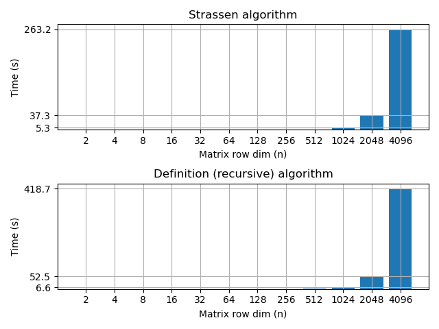

# Strassen-Algorithm
- **recursive_multiplication/matrix_recursive_mul.c**: Implements the definition algoritm (recursive version).
- **strasssen_algorithm/matrix_strassen_mul.c**: Implements the Strassen algorithm.

---

https://github.com/user-attachments/assets/cee5813d-8d14-4d88-a699-59ffc83c296b

---


## The algorithm
We aim to comtpue $C = A \times B$, where $C, A, B \in \mathcal R^{n\times n}$ and $n$ is a power of 2.
Consider:
```math
\begin{aligned}
A = \begin{bmatrix} A_{11} & A_{12} \\ A_{21} & A_{22} \end{bmatrix} \quad
B = \begin{bmatrix} B_{11} & B_{12} \\ B_{21} & B_{22} \end{bmatrix} \quad
C = \begin{bmatrix} C_{11} & C_{12} \\ C_{21} & C_{22} \end{bmatrix}
\end{aligned}
```

Let define:
```math
    \begin{aligned}
        & A_1 =(A_{12} - A_{22}) &  B_1 = (B_{21} + B_{22})\\
        & A_2 =(A_{11} + A_{22}) &  B_2 = (B_{11} + B_{22}) \\
        & A_3 =(A_{11} - A_{21}) &  B_3 = (B_{11} + B_{12})\\
        & A_4 =(A_{11} + A_{12}) &  B_4 = B_{22}\\
        & A_5 =A_{11} &  B_5 = (B_{12} - B_{22})\\
        & A_6 =A_{22} &  B_6 = (B_{21} - B_{11}) \\
        & A_7 =(A_{21} + A_{22}) &  B_7 = B_{11}\\
    \end{aligned}
```
Let define:
```math
    P_i = A_i \times B_i\quad 1\leq i \leq 7
```
In the end we get:
```math
    \begin{split}
        & C_{11} = P_1 + P_2 - P_4 + P_6\\
        & C_{12} = P_4 + P_5\\
        & C_{21} = P_6 + P_7\\
        & C_{22} = P_2 - P_3 + P_5 - P_7\\
    \end{split}
```

The algorithm:
```text
SMUL(A, B) 
    n = rows(A)
    if (n = 1) then 
        return [a11 b11] // Scalar product.

    Compute the matrices Ai, Bi for all i = 1, ..., 7
    
    for all i = 1 to 7 do
        Pi = SMUL(Ai, Bi)

    C11 = P1 + P2 - P4 + P6
    C12 = P4 + P5
    C21 = P6 + P7
    C22 = P2 - P3 + P5 - P7

    return C
```

### Usage
Compile and execute:
```
gcc strasssen_algorithm/matrix_strassen_mul.c -O3
./a.out
```

## Results
CPU: AMD Ryzen™ 5 7600


